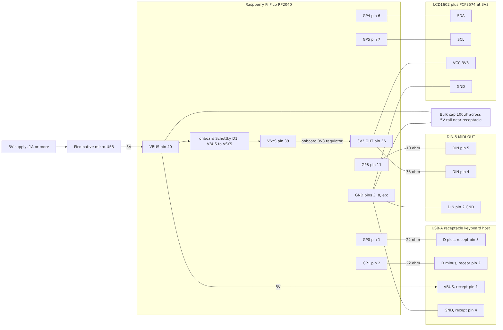
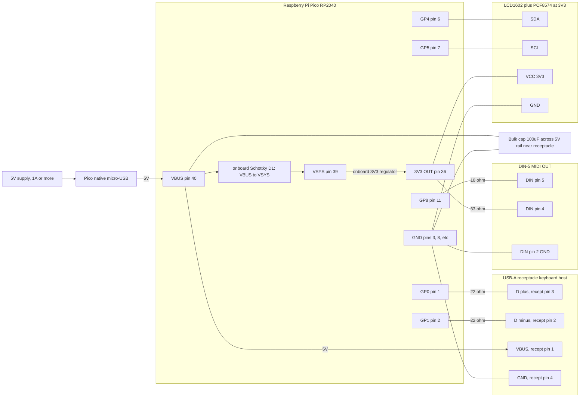

# KeybChord (Pico Edition) — Wiring Diagram

Visual companion to the canonical pin map. The pin/power tables in **Spec §2.2** and
**Roadmap §5.2** remain **authoritative** for exact pins and component values; this
diagram is a rendered connection view of those tables.

This is a **logical connection diagram** (which wire goes where), not a physical
breadboard layout. All resistors are **1/4 W (0.25 W)**.

## Combined wiring diagram

A pre-rendered image is below (use this if your Markdown viewer does not render Mermaid).
The Mermaid source follows it and is the editable source of truth; regenerate the PNG
after editing (see "Regenerating the PNG").



<details>
<summary>Mermaid source (editable)</summary>



</details>

## Legend & notes

- **All resistors 1/4 W (0.25 W)** — actual dissipation is only milliwatts.
- **USB host:** `GP0`=D+, `GP1`=D- with a **22 ohm** series resistor on each line
  (the only series elements; the keyboard supplies device-side pull-ups). Set via the
  `PIO_USB_DP_PIN_DEFAULT=0` build flag.
- **DIN MIDI OUT (3.3V loop):** driven directly from the 3.3V `GP8` TX pin —
  **10 ohm** in series with `GP8` to DIN pin 5, **33 ohm** from `3V3(OUT)` to DIN pin 4,
  GND to DIN pin 2. Standards-compliant per the MIDI 1.0 Electrical Spec update (2014).
  In firmware, call `Serial2.setTX(8)` before `Serial2.begin(31250)`. The RP2040 UART TX
  is push-pull (not open-drain) — a benign deviation that works with standard
  opto-isolated inputs; optional ferrite beads on the DIN signal pins reduce RFI.
- **LCD1602/PCF8574:** I2C0 on `GP4` (SDA) / `GP5` (SCL); **powered at 3.3V** so the I2C
  bus stays 3.3V-safe. Pull-ups from the backpack or 4.7 kohm to 3.3V. Firmware
  auto-probes address `0x27` then `0x3F`, falling back to the null LCD adapter if absent.
- **Power (canonical):** native micro-USB -> `VBUS` powers the Pico; the keyboard draws
  5V from `VBUS` (upstream of onboard Schottky **D1**, so keyboard current bypasses D1).
  Use a **>=1 A** supply sized for the cable/connector combined current, and a **100 uF**
  bulk cap on the 5V rail near the receptacle (hot-plug inrush / brownout protection).
- **Back-feed rule:** do **not** inject a regulated 5V into `VSYS` while also powered from
  native USB unless that external `VSYS` feed has **its own series Schottky diode**. Pick
  one power path. (The onboard D1 only covers `VBUS`->`VSYS`.)
- **3V3(OUT) budget:** the LCD runs off `3V3(OUT)` (~300 mA rail shared with the RP2040);
  keep a backlit LCD within budget or power its backlight separately.

For reference designs and precedent (rppicomidi, Adafruit MIDI FeatherWing, PJRC/Teensy,
MIDI.org 2014 update, Pico-PIO-USB, Pico datasheet power section), see **Roadmap §5.5**.

## Regenerating the PNG

`wiring.png` is rendered from the Mermaid source above using the Mermaid CLI:

```bash
# Extract the mermaid block to wiring.mmd, then:
npx @mermaid-js/mermaid-cli -i wiring.mmd -o wiring.png -b white -s 2
```

On a headless Linux box you may need a Chromium/`chrome-headless-shell` for Puppeteer
and a puppeteer config passing `--no-sandbox`. If Mermaid renders in your Markdown
viewer, editing the source block and re-exporting is all that's needed to refresh the PNG.

